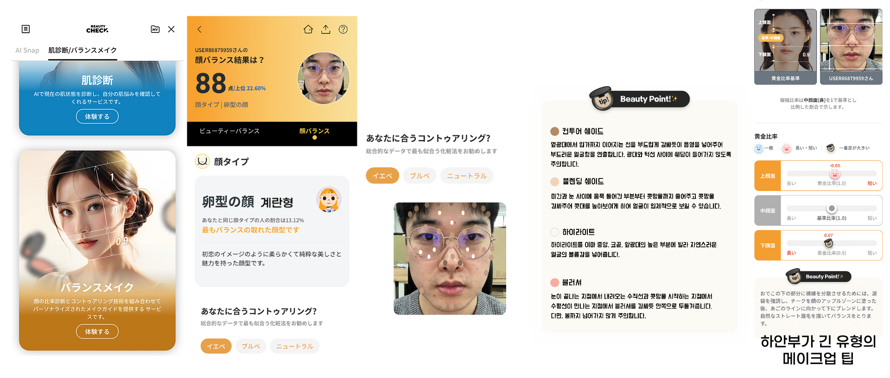

# About Me

<!--author-->

# Work Experience.

## ELINHA Co., Ltd
2022.10.31 ~ 현재 

Checco라는 플랫폼을 통해 일본에서 한국 화장품에 대한 정보를 제공하며, AI 서비스 체험, 커뮤니티, 특가 판매 등 다양한 서비스를 운영하고 있습니다. 일본 애플 앱스토어의 한국 화장품 카테고리에서 1위를 한 바가 있습니다.
### 주요 프로젝트 1. AI Snap
[기간: 2023.07.26. ~ 2023.12.12](https://learningnrunning.github.io/example/tech/review/2023-12-20-Deploying-AI-services-in-80-days/)

{:.lead width="1920" height="1080" loading="lazy"}   
유저의 셀카 이미지로 다양한 콘셉트의 이미지 사진을 제작해 주는 AI 서비스
   
#### 기여한 부분
1. SNOW의 AI 프로필, Meitu, Carat 등 경쟁 AI 이미지 생성 서비스 리뷰 후 자사만의 차별 서비스 기획
2. 정면 여부 판단 기능, 얼굴 쪽 머리카락 지우는 기능, 눈가 및 팔자주름 지우는 기능 개발
3. Stable Diffusion을 활용한 테마에 따른 이미지 생성
4. 사용자 얼굴 변경을 위한 딥페이크 기술에 중점을 둔 AI Snap 기능의 설계 및 구현
5. Docker를 활용하여 배포 시스템 구축

#### 사용한 기술
- Python
- OpenCV
- TensorFlow
- PyTorch
- Stable Diffusion
- MediaPipe, Google
- Docker

#### 성과
1. [Phase2 업데이트에 맞춰 일본 대형 이커머스와 크리스마스 콜라보 프로젝트 진행](https://www.qoo10.jp/gmkt.inc/Special/Special.aspx?sid=298299)
2. checco 플랫폼 가입자 수 AI Snap 기능 출시 후 300% 증가
   
### 주요 프로젝트 2. BalanceMakeUp
[기간: 2023.03.13.~2023.07.18.](https://learningnrunning.github.io/example/tech/review/2023-12-20-Deploying-AI-services-in-80-days/)
{:.lead width="1920" height="1080" loading="lazy"}   
유저의 얼굴 분석을 통해 ‘나에게 맞는 미‘, ‘내 얼굴에 맞는 메이크업’을 제시해주는 서비스
   
### 기여한 부분
1. 기획서 작성부터 PoC 진행 등 모든 회의에 참석하여 서비스 개발을 주도
2. 얼굴 분석 모델 개발
   1.  얼굴형 분류 기능
   2.  얼굴 비율 분석 기능
3. 메이크업 전문가와 협업을 통해 메이크업 가이드 문구 정리
4. Docker Compose를 이용하여 Nginx와 FastAPI를 사용하는 병렬 처리 구현

### 사용한 기술
- Numpy
- TensorFlow
- MediaPipe, Google
- Generative Adversarial Networks (GANs)
- FastAPI
- Ngnix
- Docker
- Docker Compose

# Other Experience.
## 사이드 프로젝트 
### 1. [What2Eat 머먹?](https://what2eat-chat.streamlit.app/)
카카오맵 리뷰에서 유의미한 평가만 모은 맛집 추천 서비스
#### 기여한 부분
일에 치여 기운이 없을 때마다 꿈의 프로젝트를 생각하며 한 단계씩 업그레이드 해나가는 저만의 프로젝트입니다.
로고디자인, 스크래핑, 데이터구조 설계, 웹 서비스 개발 등 혼자 하였습니다.
지인 개발자끼리 모여 하루 해커톤을 열어, 데이터 구조 개편 작업을 하였습니다. 덕분에 읽기 속도가 빨라 졌습니다. 

#### 개발 방법
{:.lead width="1920" height="1080" loading="lazy"}
1. 유의미한 호(好) 리뷰 찾는 방법
   카카오맵에서 스크래핑 해온 음식점 리뷰 데이터에서 개인의 평균 평점이 3.8 이상인 유저가 해당 음식점에 4점 이상의 별점을 남겼다면 유의미한 호(好) 리뷰어라고 판단했습니다.
   * 쩝쩝박사 - 유의미한 호(好) 리뷰어 인원
   * 쩝쩝퍼센트 - (유의미한 호(好) 리뷰어 수/ 전체 리뷰어 수) * 100
   
   ##### 화면 노출 조건
   쩝쩝박사 인원 수가 5명이 넘는 음식점 중에서 쩝쩝 퍼센트가 높은 순으로 목록을 제공됩니다.
2. 유의미한 비호(非好) 리뷰 찾는 방법
   개인의 평균 평점이 3.5 이상인 유저가 해당 음식점에 1.5점 이하로 별점을 남겼다면 유의미한 비호(非好) 리뷰어라고 판단했습니다.
   * 비호퍼센트 - 유의미한 비호(非好) 리뷰어 수 / 전체 리뷰어수 * 100
   ##### 화면 노출 조건
   비호퍼센트가 10프로 넘으면 호(好) 화면 노출 조건에 맞더라도 비호퍼센트를 노출하며 주의를 줍니다.
3. 채팅 형식의 UX
   처음엔 지도 기반으로 개발 하였습니다. Streamlit으로 프런트를 짜다보니, 자유도가 많이 떨어졌습니다. 지도에 갖혀 벗어나지 못 하는 등 유저들이 불편하다는 피드백이 많았습니다.
   그러다가 카카오톡에서 친구에게 맛집 리스트를 보내주듯 구현하면 어떨까 아이디어가 떠올라. 맛잘알 친구가 알려주는 맛집 리스트 개념으로 UX를 잡았습니다.
  {:.lead width="1920" height="1080" loading="lazy"}
#### 사용한 기술
- Streamlit
- Pandas
- Selenium

[What2Eat_Chat(채팅 기반)](https://what2eat-chat.streamlit.app/)

[What2Eat(지도 기반)](https://what2eat.streamlit.app/)

[What2Eat 소스코드](https://github.com/LearningnRunning/What2Eat/tree/main)

### 2. NoCountryForOldMan
세대 간 인식의 격차가 심화되는 오늘날의 추세 속에, 영화 <인턴>의 리뷰를 통해 주니어 세대가 바라보는 이상적인 시니어 세대의 모습을 알아보는 것을 목적으로 하는 모두랩 논문 연구 프로젝트

#### 사용한 기술
- Pandas
- Selenium
- BeautifulSoup4
- scikit-learn
- LangChain
- Mistral-7B
- Sentence-transformers model
  
#### 기여한 부분
1. CGV, 왓챠, 다음영화에서 리뷰 스크래핑 
2. 맞춤법검사, 문장분리, 감성분석, 군집화 전반적인 코드 작업
3. LLM을 활용한 군집별 요약 작업
4. 연구 방법, 결론(2_2) 부분 논문 작성

#### 성과
1. 2023 모두콘 연사 < LLM을 이용한 색다른 Topic 모델링>

### 3. naverTrans
네이버 검색창의 번역 기능을 사용하는 파이썬 패키지

#### 기여한 부분
1. 네이버 검색창 Ajax API를 활용한 패키지 코드 작업
2. [Pypi 업로드](https://pypi.org/project/navertrans/)

## Skill.
{:.lead width="1920" height="1080" loading="lazy"}

- [2022 빅데이터 경진대회 ‘사회보장 유레카’ 우수상](https://drive.google.com/file/d/10DcADYbd8-W5dN6VphZve3X8pT1ti-IH/view?usp=sharing)
- [2022 공개 SW개발자대회 동상](https://drive.google.com/file/d/1-EWjBM--Uu_0Jr7v5Wm9UtcdhvqnmFi2/view?usp=drive_link)
- 2023 수묵화 데이터셋을 활용한 공모전 장려상

## 발표 및 기타 활동
- 요기요 '취향식탁' 마케팅팀 기술 PT
- 네이버 부스트코스 코딩코치
  - 코칭스터디 Data Science Projects 2024
  - 코칭스터디 12기 Python Everybody
  - 코칭스터디 10기 Beyond AI Basic
- 모두의 연구소 “노인을 위한 나라는 없다” 랩 활동
- 모두콘2023 연사 < LLM을 이용한 색다른 Topic 모델링>

{:.lead width="1920" height="1080" loading="lazy"}

## 교육
- 2011 포항 대동고등학교 
- 2015 용인대학교 영화영상학과
- 2022 (주)엔코아 부트캠프 PLAYDATA AI 과정
- 2023 방송통신대학교 통계 데이터학과

<!-- ### 

<a href="https://gumroad.com/l/nuOluY">Loading…</a>
 -->

[blog]: /
[portfolio]: https://hydejack.com/examples/
[resume]: https://hydejack.com/resume/
[download]: https://hydejack.com/download/
[welcome]: https://hydejack.com/
[forms]: https://hydejack.com/forms-by-example/

[features]: #features
[news]: #build-an-audience
[syntax]: syntax-highlighting
[latex]: #beautiful-math
[dark]: https://hydejack.com/blog/hydejack/2018-09-01-introducing-dark-mode/
[search]: https://hydejack.com/#_search-input
[grid]: https://hydejack.com/blog/hydejack/

[lic]: LICENSE.md
[pro]: licenses/PRO.md
[docs]: docs/README.md
[ofln]: docs/advanced.md#enabling-offline-support
[math]: docs/writing.md#adding-math

[kit]: https://github.com/hydecorp/hydejack-starter-kit/releases
[src]: https://github.com/hydecorp/hydejack
[gem]: https://rubygems.org/gems/jekyll-theme-hydejack
[buy]: https://gum.co/nuOluY

[gpss]: https://developers.google.com/speed/pagespeed/insights/?url=https%3A%2F%2Fhydejack.com%2Fdocs%2F
[rouge]: http://rouge.jneen.net
[katex]: https://khan.github.io/KaTeX/
[mathjax]: https://www.mathjax.org/
[tinyletter]: https://tinyletter.com/
